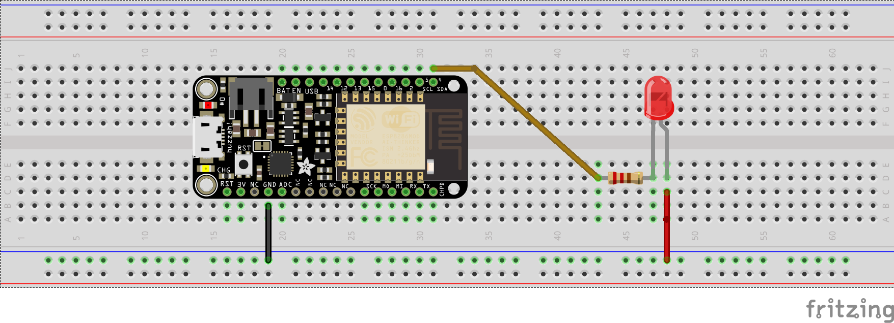
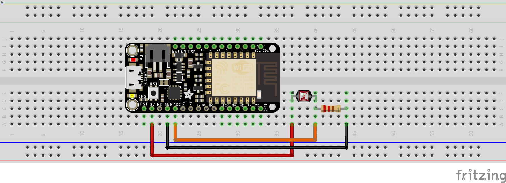

# PAN.PROJECT
<b>IOT- Projekt VIII<b><br />
<b>LICHTSENSOR<b>


Getting started with Arduino?
Wanna get confortable within a easy little Project?<br />
Degree of difficulty: easy<br />
<b>Then you´re absolutly right with PAN!<b>
  
Here you´ll see a little overview about the Project:<br />
As already thought the PAN Project is about a light sensor, in which you can control different brightness levels.<br />
The Client regulate those configurations. Moreover you have the opportunity to manage the Arduino with your Smartphone via WIFI <br />

<b>ANYAWAY, HAVE FUN!<b>


# Prerequisites
* Download and install the [Arduino Software IDE](https://www.arduino.cc/en/Main/Software)
  * follow instructions on [this page](https://learn.adafruit.com/adafruit-feather-huzzah-esp8266/using-arduino-ide) to install driver and board packages
  * this repo also contains dotfiles and workspace files for [Visual Studio Code](https://code.visualstudio.com/). If you choose to work with VS Code you will still need everything above and also [this extension](https://marketplace.visualstudio.com/items?itemName=vsciot-vscode.vscode-arduino).
* More useful info on the [Adafruit Feather HUZZAH ESP8266](https://learn.adafruit.com/adafruit-feather-huzzah-esp8266/overview)

# Client
The client consists of an Adafruit Feather HUZZAH ESP8266 and an LED as actor. The LED brightness is regulated via [pulse width modulation](https://www.arduino.cc/en/pmwiki.php?n=Reference/AnalogWrite). The Huzzah gets a sensor reading from the server via Wifi and from that calculates a brightness value to put out.

## Hardware
Connect the LED with a resistor in front of it to pin 4 (labled "SDA" on the Huzzah). Notice that LEDs (Light Emitting Diodes), as all diodes, only allow current to pass in one direction. It won't work the LED's the wrong way around.


## Configuration
* Enter credentials for your WiFi
  ```c
  // WiFi Credentials
  const char* ssid = "myWifiSSID";    // name of the network
  const char* password = "myWifiKey"; // WiFi key
  ```
* If you use a different board than the Adafruit Feather HUZZAH ESP8266 make sure to have the correct pin number and set ledPin accordingly
  ```c
  const int ledPin = 4; // the Pin that the LED is connected to
  ```  
* Set adress to your brightness value. This will normally be `http://ServerIP/brightness`. If you need a value that can't be overridden by the server you can use `http://ServerIP/sensor`. For more information refer to the [Server section](#Server) of this file
  ```c
  http.begin("http://192.168.0.23/brightness");  // server adress (change to your server's address)
  ```
* Set how often this client gets the brightness value. from the server
  ```c
  int getValueDelay = 300;  // milliseconds between http requests
  ```
* Write your calcBrightness! By default clients will put the recieved brightness value through to the pin. This behaviour can easily be changed to suit your needs. Check the following section to get an idea!
### calcBrightness examples
_TODO:_ write a few examples


# Server
The client consists of an Adafruit Feather HUZZAH ESP8266 and an photoresistor as sensor. The sensor is connected the analog-to-digital converter (ADC) of the board. The ADC measures the voltage and generates a value between 0 - 1023.
Whenever a client sends a GET request the server will answer by sending some data. The following handlers are implemented:

| URL                 | Data           |
| ------------------- | -------------- |
| ServerIP/sensor     | sensor reading | 
| ServerIP/brightness | sensor reading or override value, depending on checkbox on / |
| ServerIP/           | a web interface to enter override |

## Hardware


## Configuration
* Enter credentials for your WiFi
  ```c
  // WiFi Credentials
  const char* ssid = "myWifiSSID";    // name of the network
  const char* password = "myWifiKey"; // WiFi key
  ```
* If you use a different board than the Adafruit Feather HUZZAH ESP8266 make sure to have the ADC pin number set
  ```c
  const int sensorPin = 0; // the pin that the photoresistor is connected to
  ```  
* The IP address will usually be automatically assigned by your Access Point. To find out you servers address you could [scan your network](https://askubuntu.com/a/224567), check the DHCP table of your AP or connect the server to a computer via USB, open a [serial monitor](https://www.arduino.cc/en/Guide/Environment#toc12). You should get a message like this:
  ```
  Connected to YourWifi
  IP address: 192.168.0.42
  HTTP server started
  ```
* You can connect to http://ServerIP with a web browser of any device in the same network. There will be a small interface that shows the sensor reading at the moment of loading the page. You also can set an override for /brightness.


## Logging Data on SD card with Adalogger
[Adalogger](https://learn.adafruit.com/adafruit-feather-m0-adalogger/using-the-sd-card#) support hasn't been implemented yet. You will need to set `chipSelect = 15;`